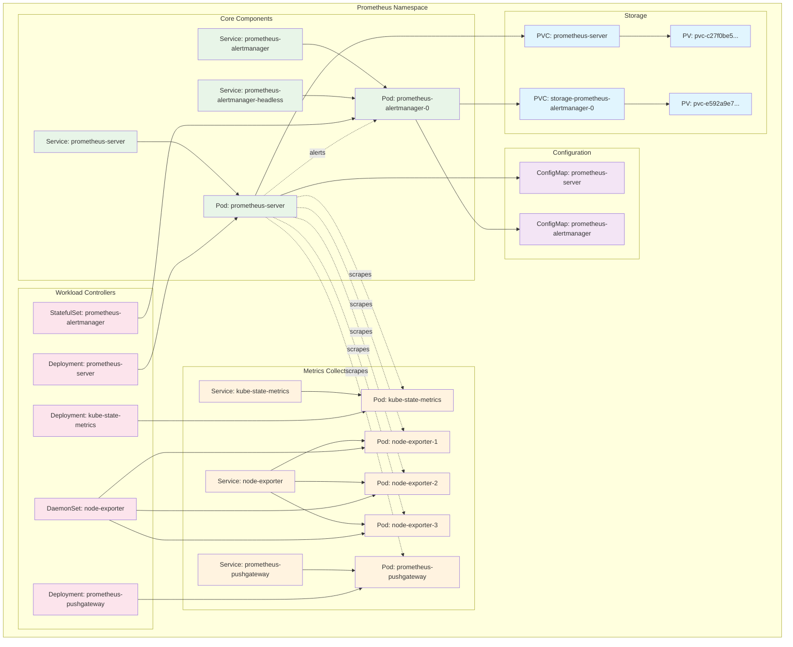
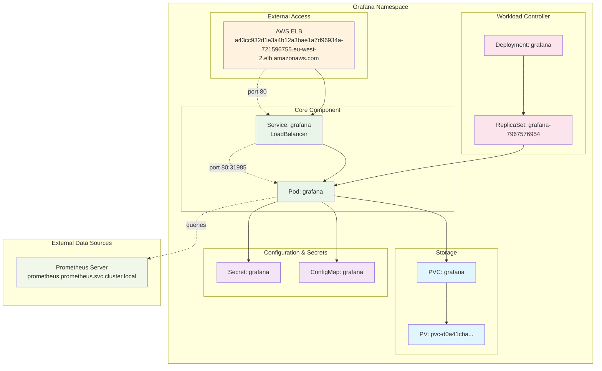
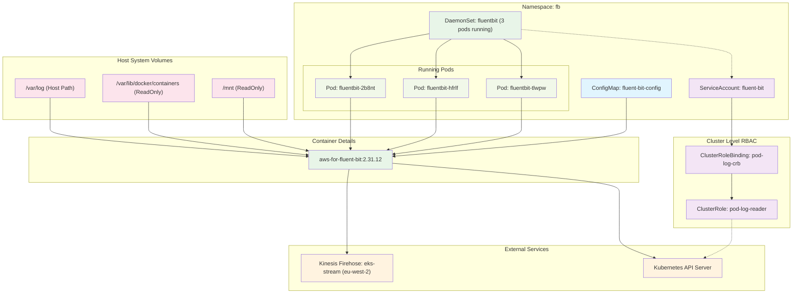
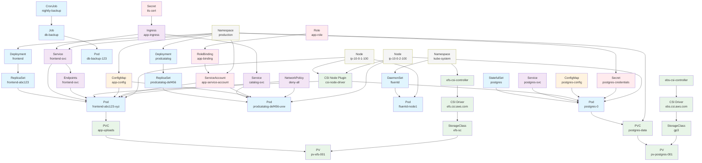

# EKS Class 20250915
Q and A during the class

## Question: Pod restart after config change?
> A question about Kubernetes. If I have a running pod, and one container inside, and I change a related manifest, e.g. the pod manifest or deployment manifest. Under which manifest change circumstances is the pod restarted, and when is it not restarted?

## Answer:
> In Kubernetes, pod restart behavior depends on what fields you modify in the manifest:

### Pod is restarted when you change:

Pod spec fields (immutable after creation):

• Container image (spec.containers[].image)

• Container command/args (spec.containers[].command, spec.containers[].args)

• Environment variables (spec.containers[].env)

• Volume mounts (spec.containers[].volumeMounts)

• Resource requests/limits (spec.containers[].resources)

• Security context (spec.securityContext, spec.containers[].securityContext)

• Service account (spec.serviceAccountName)

• Node selector (spec.nodeSelector)

• Tolerations (spec.tolerations)

• Affinity rules (spec.affinity)

For Deployments specifically:
• Any change to spec.template triggers a rolling update, creating new pods and terminating old ones

### Pod is NOT restarted when you change:

Metadata fields:

• Labels (metadata.labels) - except those used by selectors

• Annotations (metadata.annotations)

Deployment fields outside the pod template:

• Replica count (spec.replicas) - scales up/down without restarting existing pods

• Deployment strategy (spec.strategy)

• Progress deadline (spec.progressDeadlineSeconds)

Service and other resource changes:

• Service port changes

• ConfigMap/Secret content (unless pod has restartPolicy configured to watch them)

### Key distinction:

• **Direct Pod edits**: Most spec fields are immutable, so you'll get an error instead of a restart

• **Deployment edits**: Changes to spec.template trigger controlled rolling updates

• **ConfigMap/Secret updates**: Pods don't automatically restart unless you use tools like Reloader or change
the ConfigMap/Secret name in the pod spec

## Verify if a pod was restarted or not: check pod age and restart count:
```
kubectl get pods -o wide -A
```
Look at the AGE column - if it's recent, the pod was recreated. The RESTARTS column shows container restarts within the
same pod.

The general rule: if it affects how the container runs (image, environment, resources), the pod restarts. If
it's just metadata or scaling, it doesn't.

## Question: When a node is tainted, are services also affected?

When I taint a worker node in such a way that all running pods are evicted, is there any other resource which gets evicted as well? For example, a service?

## Answer:
> No, tainting a node only evicts pods. Other Kubernetes resources are not directly affected by node taints.

## What gets evicted:
• **Pods only** - those without matching tolerations

## What does NOT get evicted:

• **Services** - they're cluster-scoped abstractions, not tied to specific nodes

• **ConfigMaps** - stored in etcd, not on nodes

• **Secrets** - stored in etcd, not on nodes

• **PersistentVolumes** - storage resources independent of nodes

• **Ingress** - routing rules, not node-specific

• **NetworkPolicies** - cluster networking rules

• **ServiceAccounts** - authentication resources

## However, indirect effects occur:

Services become unreachable if:

• All pods backing the service are evicted

• No other nodes can schedule replacement pods (due to tolerations/constraints)

Persistent workloads may be affected if:

• StatefulSets can't reschedule pods elsewhere

• PersistentVolumes are node-local (hostPath, local storage)

## Question: permissions to allow AWS User to see Kubernetes resources (e.g Pods) in AWS Management Console?
Regarding Amazon EKS: in Ireland, I have one EKS cluster running. After cluster installation, I was not able to see any cluster resources (e.g. Pods) in the AWS Management console EKS user interface. This was fortunately corrected some time ago. Which change or permission setting is needed to allow the Management Console user to view cluster resources in the AWS Management console?

## Answer:
The issue you experienced is related to EKS cluster authentication and authorization. To view cluster resources (pods, services, etc.) in the AWS Management Console, you need to configure the EKS cluster's RBAC (Role-Based Access Control) to allow your AWS IAM user or role access.

The specific change needed is adding your IAM user/role to the EKS cluster's aws-auth ConfigMap with appropriate permissions. Here's the minimal configuration:
```
apiVersion: v1
kind: ConfigMap
metadata:
  name: aws-auth
  namespace: kube-system
data:
  mapUsers: |
    - userarn: arn:aws:iam::<account-id>:user/<username>
      username: <username>
      groups:
        - system:masters
```

Or for an IAM role:
```
  mapRoles: |
    - rolearn: arn:aws:iam::<account-id>:role/<role-name>
      username: <role-name>
      groups:
        - system:masters
```

Apply this with:
```
kubectl apply -f aws-auth-configmap.yaml
```

Alternatively, you can use the AWS CLI to add the mapping:

```
eksctl create iamidentitymapping \
  --cluster <cluster-name> \
  --region eu-west-1 \
  --arn arn:aws:iam::<account-id>:user/<username> \
  --group system:masters \
  --username <username>
```

This grants the IAM principal cluster-admin permissions, allowing the Management Console to display cluster resources. The system:masters group provides full cluster access - you can use more restrictive groups if needed for production environments.

## Question: Helm release revision vs. version

> Using helm, if you apply a "helm upgrade", does the version number increase?

## Answer:
> No, running helm upgrade does not automatically increase the version number of your Helm chart.

Here's what actually happens:

Chart Version vs Release Revision:

• The chart version is defined in Chart.yaml and only changes when you manually update it

• Helm tracks release revisions internally (1, 2, 3, etc.) which increment with each upgrade

What helm upgrade does:

• Deploys changes to your Kubernetes resources

• Increments the release revision number

• Can use the same chart version or a different one

To increase the chart version, you need to manually edit Chart.yaml:
```
apiVersion: v2
name: my-app
version: 1.2.0  # Manually increment this
```

Example workflow:
```
# First deployment
helm install my-app ./chart  # Creates revision 1

# Upgrade with same chart version
helm upgrade my-app ./chart  # Creates revision 2, same chart version

# Upgrade with new chart version
# (after manually updating Chart.yaml version)
helm upgrade my-app ./chart  # Creates revision 3, new chart version
```

You can check both with:
```
helm list                    # Shows chart version
helm history my-app          # Shows revision history
```
The version number is a manual, semantic versioning decision you make as the chart maintainer.

Example from the lab:
```
helm history productcatalog

REVISION        UPDATED                         STATUS          CHART                           APP VERSION     DESCRIPTION
1               Tue Sep 16 10:41:34 2025        superseded      productcatalog_workshop-1.0.0   1.0             Install complete
2               Tue Sep 16 10:46:17 2025        superseded      productcatalog_workshop-1.0.0   1.0             Upgrade complete
3               Tue Sep 16 10:47:17 2025        deployed        productcatalog_workshop-1.0.0   1.0             Rollback to 1
```

Follow-up question: In which case is the creation of a new release version suitable, versus a new release revision?

> New Release Version (chart version) is suitable when:

• Adding new features or capabilities to the application

• Making breaking changes to configuration or APIs

• Significant architectural changes

• Major bug fixes that change behavior

• Changes to chart templates, dependencies, or structure

• Following semantic versioning for distribution

New Release Revision (deployment revision) happens automatically when:

• Changing configuration values without updating the chart

• Applying hotfixes using the same chart version

• Rolling back to previous configurations

• Environment-specific tweaks (dev vs prod settings)

• Scaling replicas or resource limits

• Updating secrets or configmaps

Examples:
```
# New chart version - you've updated the application code
helm upgrade myapp ./mychart --version 2.0.0

# New revision only - same chart, different config
helm upgrade myapp ./mychart --set replicas=5

# New revision only - same chart, different values file
helm upgrade myapp ./mychart -f production-values.yaml
```

Rule of thumb:

• Bump chart version when you change what the application does

• Let revisions increment naturally when you change how it's configured

## Lab 4 prometheus components mermaid diagram:



### Lab 4 Grafana architecture:


## Lab 4 fluentbit components:



## Live FluentBit Resources Summary

**Active Components:**
- **DaemonSet**: `fluentbit` with 3 running pods across cluster nodes
- **Pods**: `fluentbit-2b8nt`, `fluentbit-hfrlf`, `fluentbit-tlwpw`
- **ConfigMap**: `fluent-bit-config` with FluentBit configuration and CRI parser
- **ServiceAccount**: `fluent-bit` for pod identity
- **ClusterRole**: `pod-log-reader` with permissions to read pods/namespaces
- **ClusterRoleBinding**: `pod-log-crb` linking ServiceAccount to ClusterRole

**Data Flow:**
1. Each pod reads container logs from `/var/log/containers/*.log`
2. Applies CRI parser to process Docker/containerd log format
3. Injects Kubernetes metadata via API server calls
4. Sends processed logs to Kinesis Firehose stream `eks-stream` in `eu-west-2`
5. 

## Lab 5 K8s resource components:



## Key Relationships Explained:

**Workload Flow:**
- Deployments create ReplicaSets, which manage Pods
- Services expose Pods via Endpoints
- Ingress routes external traffic to Services

**Storage Chain:**
- Pods request storage via PVCs
- PVCs bind to PVs created by StorageClasses
- CSI controllers (EFS, EBS) provision storage through CSI drivers

**Configuration & Security:**
- ConfigMaps and Secrets provide configuration to Pods
- ServiceAccounts enable Pod authentication
- RBAC (Roles/RoleBindings) control access permissions

**Infrastructure:**
- Nodes host Pods and CSI node plugins
- Namespaces organize and isolate resources
- Cluster components (API server, scheduler, etc.) orchestrate everything
- Namespaces organize and isolate resources
- Cluster components (API server, scheduler, etc.) orchestrate everything
